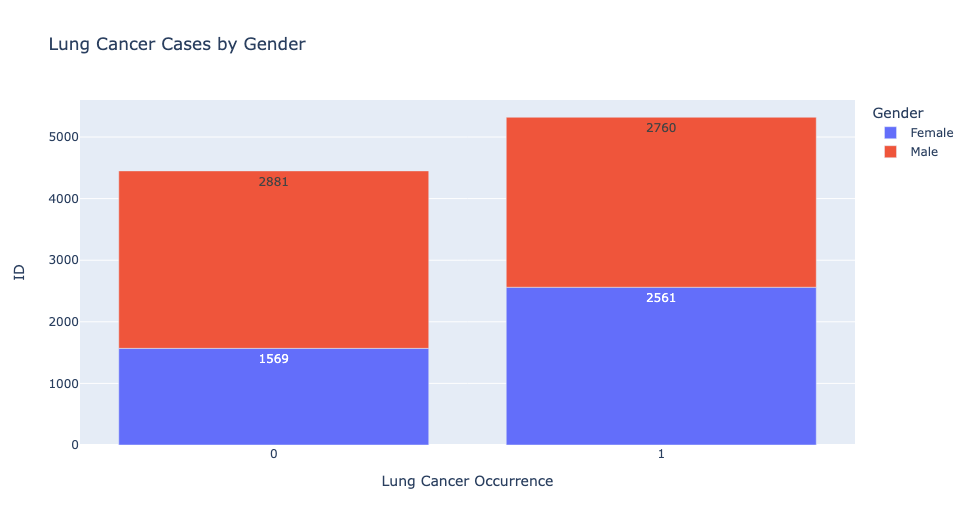
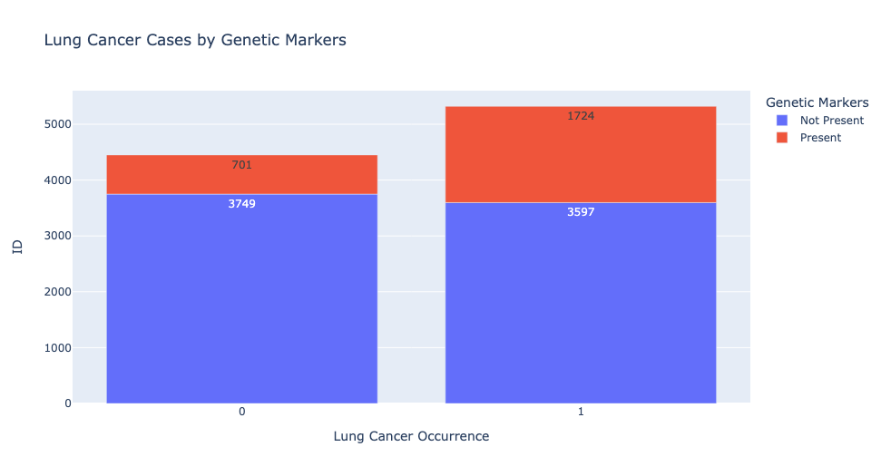
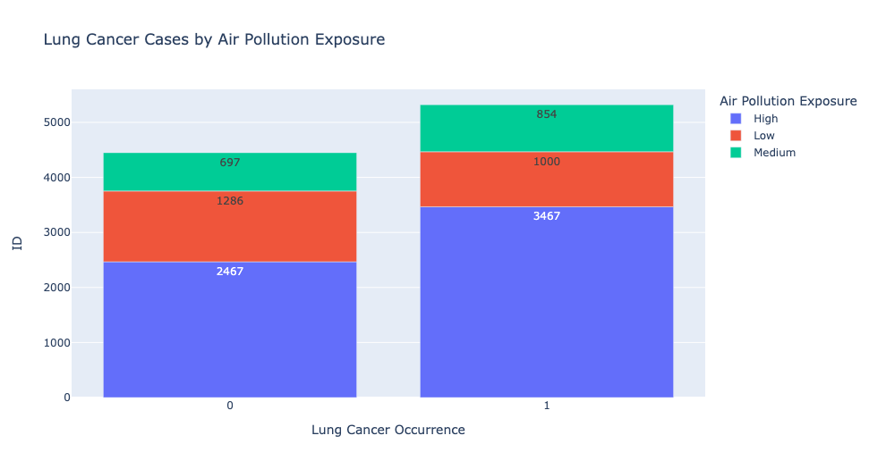
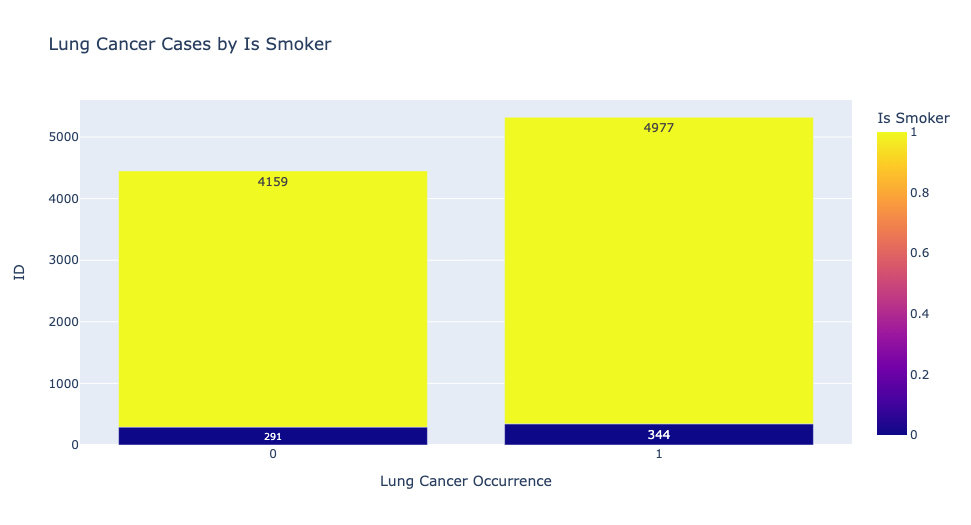
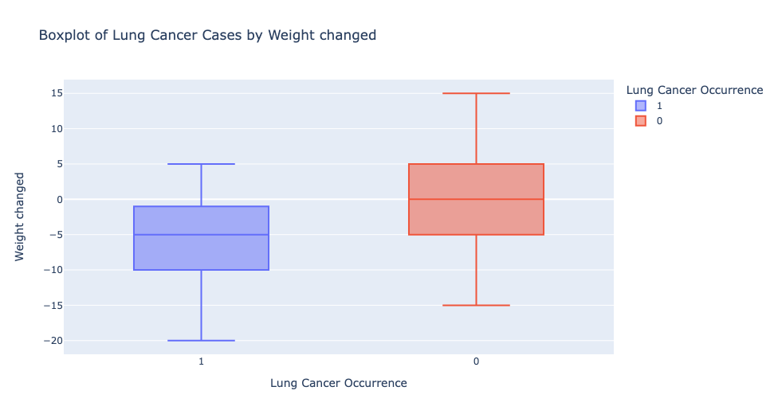
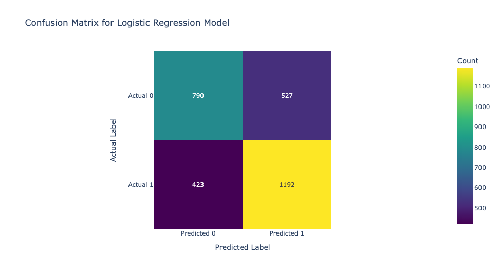
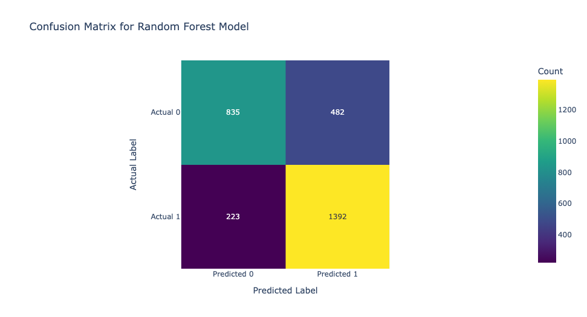
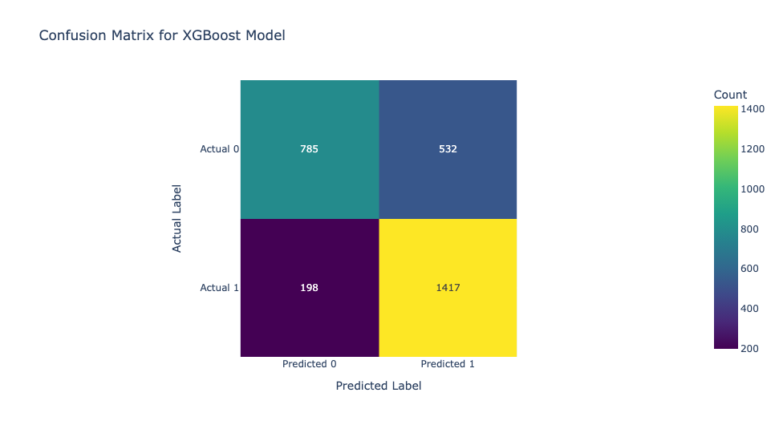

# End-to-end Machine Learning Pipeline (AIAP #16)

### Overview
- Attempted technical assessment for AI Singapore Apprentice Programme #16

#### Folder Structure
```
aiap16
│
├── data/
│ ├── lung_cancer.csv
│ ├── lung_cancer_cleaned.csv
│ └── lung_cancer_data_report.html
│
├── img/
│ ├── gender.png
│ ├── genetic_markers.png
│ ├── air_pollution.png
│ ├── smoker.png
│ ├── weight_changed.png
│ ├── lr_cm_fig1.png
│ ├── rf_cm_fig2.png
│ ├── xgb_cm_fig3.png
│ └── confusion_matrix.png
│
├── src/
│ ├── init.py
│ ├── config.py
│ ├── evaluate.py
│ ├── model.py
│ ├── predict.py
│ ├── preprocess.py
│ └── train.py
│
├── eda.ipynb
├── main.py
├── README.md
├── requirements.txt
└── run.sh
```

#### Instructions 📌
- To run the end-to-end machine learning pipeline, you can run the following commands. 
- *Note: Instructions assumed that you have created a virutal environment `venv` with requirements installed via `requirements.txt`. If this is not the case, you can open the `run.sh` file and uncomment the command to create virtual environment and install requirements before executing `run.sh` file.*

```bash
git clone https://github.com/Mono-PQ/aiap16.git
cd aiap16
chmod +x run.sh
./run.sh
```

#### Description of pipeline 📝
- The pipeline runs a `main.py` file that combines the modules in `src` directory into a program with the following steps:
    1. Download `.db` file from online resource.
    2. Query `.db` file and load as pandas dataframe.
    3. Save raw data in data folder.
    4. Preprocess (cleaning, feature engineering, scaling and encoding) of raw data.
    5. Save clean data in data folder.
    6. Train model based on user's preferred model.
    7. Split data based on user's preferred test size.
    8. Evaluate model based on user's preferred threshold.
    9. Generate a confusion matrix diagram in img folder.

#### Key Findings of Exploratory Data Analysis 📊

##### General 
- Based on the `lung_cancer_data_report.html` generated using `sweetviz`, missing values were noted for the following features:
  - `COPD_History`: 11%
  - `Air Pollution Exposure`: <1%
  - `Taken Bronchodilators`: 10%
- There were also **350** duplicated records in the raw data which needs to be removed. 
- Anomalies in `age` were excluded, in particular records with negative values and value more than [115](ttps://www.asiaone.com/health/100-she-could-still-walk-10th-floor).
- Categorical names of `gender` need to be standardised with those tagged as `Nan` removed. 
- Renaming of a categorical name of `Dominant Hand` from "RightBoth" to "Both" so that it's more intuitive. 

##### Feature Engineering
The following features were transformed for better understanding of the patient profile:
- A new feature `Weight changed` can be obtained by subtracting the current weight with the last weight of the patient. `Weight changed` (gain or loss) often ties to changes in the patient's health status. 
- Separately, the `Start Smoking` and `Stop Smoking` columns allows us to identify if patient is a smoker and, if so, how long they have been smoking. Whether someone is a smoker and how long he/she has been smoking could be a predictor of lung cancer. 

##### Categorical Features

1. Gender: More female were diagnosed with lung cancer


2. Genetic Markers: Those with genetic markers present were more likely to be diagnosed with lung cancer


3. Air Pollution Exposure: Those with high exposure to air pollution were more likely to be diagnosed with lung cancer


4. Is Smoker: More smokers were diagnosed with lung cancer


##### Numerical Features

1. Weight Changed: Only numerical feature that reflects a significant difference in the median value for cases with lung cancer. It seems to imply that significant weight loss could be an indicator of lung cancer.


#### Data Processing of Features 💻
|Attributes|Description|Processing|
|----------|-----------|----------|
|ID|Patient ID|-|
|Age|Patient Age|Remove anomalies (negative values and value exceeding oldest age in Singapore, i.e., 115)|
|Gender|Patent Gender|Standardise gender name to titlecase and remove records with Nan value|
|COPD History|Whether patient has a history of chronic Obstructive Pulmonary Disease|Include new "Unknown" category for missing data and numerical encoding|
|Genetic Markers|Presence of any genetic markers known to increase the risk of lung cancer|Numerical encoding|
|Air Pollution Exposure|Level of air pollution exposure in the patient's daily life|Dropped missing values and numerical encoding|
|Last Weight|Last officially recorded weight of patient|Dropped|
|Current Weight|Current officially recorded weight of the patient|-|
|Start Smoking|Year that the patient starts smoking|Dropped|
|Stop Smoking|Year that the patient stops smoking|Dropped|
|Taken Bronchodilators|Whether the patient is previously prescribed Bronchodilatory medications|Include new "Unknown" category for missing data and numerical encoding|
|Frequency of Tiredness|Frequency of patient feeling tiredness in day|Numerical encoding|
|Dominant Hand|Dominant hand of the patient|Rename "RightBoth" to "Both" and numerical encoding|
|Weight changed|Change in patient's weight from last record|Computed using `Current Weight` - `Last Weight`|
|Is Smoker|Whether patient is a smoker|Computed by checking if `Start Smoking` is not `Not Applicable`|
|Smoking Length|How long the patient has been smoking if he/she is a smoker|Computed using `Stop Smoking` - `Start Smoking`. For present smoker, length is computed using `2024` - `Start Smoking`. For non-smoking, value would be `0`.|

- Scaling is done using `StandardScaler`. 
- Shape of raw data: (10348, 14)
- Shape of final data: (9771, 14)

#### Model Choice & Rationale 👍🏻
Based on the problem statement, the algorithms that can be explored for model building is classification which include:

- Logistic regression
- Decision Trees
- Random Forest
- Support Vector Machines (SVM)
- Gradient Boosting Machines (GBM) etc.

For the purpose of this project, only Logistic Regression (baseline), Random Forest and Gradient Boosting Machine (GBM) are explored and trained due to time constraint. These algorithms can be built into the final end-to-end machine learning pipeline for users to experiment and evaluate the performance of each algorithms for their information.

The reason for prioritising random forest is because it's an ensemble model which works well in many classification problem and reduce the likelihood of overfitting to training data. Additionally, random forest algorithms can be used to reflect the relative feature importance of our data. 

XGBoost is also an ensemble learning model using gradient boosting implementation. It uses tree-based learners and employs regularisation technique to prevent overfitting. Generally, it's an efficient algorithm and provides feature importance analysis. 

#### Model Evaluation and Metrics 📏
- Metrics used for evaluating the model are as follows:
  - AUC
  - Confusion matrix
  - F1-Score

|Model|AUC|Confusion Matrix|F1-Score (weighted avg)|
|-----|---|----------------|--------|
|Logistic Regression|0.7581|Figure 1 below|0.67|
|Random Forest|0.8445|Figure 2 below|0.76|
|XGBoost|0.8435|Figure 3 below|0.74|

Figure 1: Logistic Regression Confusion Matrix


Figure 2: Random Forest Confusion Matrix


Figure 3: XGBoost Confusion Matrix


##### Confusion Matrix of Logistic Regression Model
As shown in the above confusion matrix, the number of false positive and false negative are 527 and 423 respectively.

##### Suitability of Lung Cancer Prediction
However, if we consider the cost of the problem statement, it is probably most costly to predict those with lung cancer as negative as it concerns patient's life and could potentially rob the patient's early treatment opportunity that could increase the chance of recovery and survivability. Hence, we'll prioritise algorithms and set an appropriate threshold that reduce the number of false negatives.

##### Confusion Matrix of Random Forest Model
The number of false negative prediction, **223**, is significantly lesser than the logistic regression model (baseline) which was **423**. Hence, the random forest model is relatively better for lung cancer prediction.

##### Confusion Matrix of XGBoost Model
The number of false negative prediction, 198, is significantly lesser than the logistic regression model (baseline) which was 532. Hence, the XGBoost model is also relatively better for lung cancer prediction.

#### Assumptions and other considerations 🤔
- Feature selection could be considered to reduce the number of features for the model. However, as the number of features is small (i.e., 12), this was not considered and explored in the interest of time. 
- When tuning the model, `RandomSearchCV` was used instead of `GridSearchCV` in the interest of time and limited computed power. Hence, the final parameters chosen to build the model may not be the best ones. 
- `predict.py` was included to provide a means for user to predict new data using the trained model. However, the functionality was not implemented in the interest of time. 
- The implementation was designed in consideration of allowing users to experiment with different algorithms, test size, and threshold during model training and evaluation. 
- Threshold could be adjusted based on the risk tolerance of false negatives due to higher cost as explained under [suitability of lung cancer prediction](#suitability-of-lung-cancer-prediction)